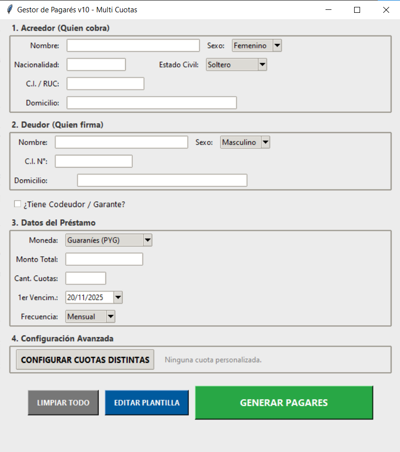

# 🏦 Sistema Gestor de Pagarés Automatizado

  

Aplicación de escritorio profesional desarrollada en Python para automatizar la generación masiva de pagarés y documentos financieros. Diseñada para eliminar errores humanos, cálculos manuales y problemas de redacción legal.

## 🚀 Características Principales

### 1. Gestión Financiera Avanzada
* **Cálculo Automático:** Divide el monto total según la cantidad de cuotas.
* **Cuotas Personalizadas (Gestor Avanzado):** Permite definir montos específicos para cualquier cuota (ej: Entrega inicial en Cuota 1, refuerzos semestrales, o pago final tipo "Balón") y recalcula el resto automáticamente.
* **Multi-Moneda:** Soporte nativo para Guaraníes (PYG), Dólares (USD), Reales (BRL), Euros (EUR) y Pesos Argentinos (ARS).
* **Formato Inteligente:** Separadores de miles automáticos al escribir (ej: 10.000.000).

### 2. Redacción Legal Inteligente
* **Conversión a Letras:** Convierte automáticamente los montos numéricos a texto legal (ej: "DIEZ MILLONES DE GUARANIES").
* **Gramática de Género:** Detecta el sexo del Acreedor/Deudor y ajusta el contrato ("el señor", "la señora", "domiciliado", "domiciliada").
* **Codeudor/Garante Opcional:** Sistema condicional. Si no se marca la casilla de codeudor, la sección desaparece del documento final sin dejar espacios en blanco.

### 3. Generación de Documentos
* **Motor de Plantillas:** Utiliza archivos Microsoft Word (`.docx`) como base, permitiendo editar el contrato legal sin tocar el código.
* **Archivo Único:** Genera un solo documento Word que contiene todos los pagarés secuenciados (Pág 1: Cuota 01/12, Pág 2: Cuota 02/12, etc.), listos para imprimir.
* **Calendario:** Cálculo automático de fechas de vencimiento (Mensual, Bimestral, Semestral, Anual, etc.).

---

## 📷 Capturas de Pantalla



---

## 🛠️ Instalación y Requisitos

Si deseas ejecutar el código fuente, necesitarás Python instalado.

1.  **Clonar el repositorio:**
    ```bash
    git clone [https://github.com/TU_USUARIO/Gestor-Pagares-Py.git](https://github.com/TU_USUARIO/Gestor-Pagares-Py.git)
    ```

2.  **Instalar dependencias:**
    Este proyecto utiliza librerías externas para el manejo de GUI y Word.
    ```bash
    pip install docxtpl docxcompose num2words tkcalendar
    ```

3.  **Ejecutar la aplicación:**
    ```bash
    python GeneradorPagares.py
    ```

---

## 📄 Configuración de la Plantilla (Word)

El sistema utiliza `docxtpl` (Jinja2 tags) para rellenar el documento. Asegúrate de tener un archivo llamado `plantilla_pagare.docx` en la misma carpeta.

**Variables disponibles para usar en el Word:**

| Variable | Descripción |
| :--- | :--- |
| `{{ acreedor_nombre }}` | Nombre completo del acreedor |
| `{{ acreedor_titulo }}` | "del señor" o "de la señora" |
| `{{ deudor_nombre }}` | Nombre completo del deudor |
| `{{ monto_num }}` | Monto en números (con puntos) |
| `{{ monto_letras }}` | Monto escrito en letras |
| `{{ fecha_venc }}` | Fecha de vencimiento de la cuota |
| `{{ cuota_actual }}` | Número de la cuota actual |

**📦 Crear Ejecutable (.EXE)**

Para distribuir la aplicación en computadoras sin Python, utiliza PyInstaller.

IMPORTANTE: Se debe usar el comando --collect-all para incluir las dependencias ocultas de docxcompose.

1.  **Ejecuta en tu terminal:**
    ```bash
    pyinstaller --noconsole --onefile --collect-all "docxcompose" --name "SistemaPagares" GeneradorPagares.py
    ```

El archivo final estará en la carpeta dist/.

**By Dario Avalos💻**
